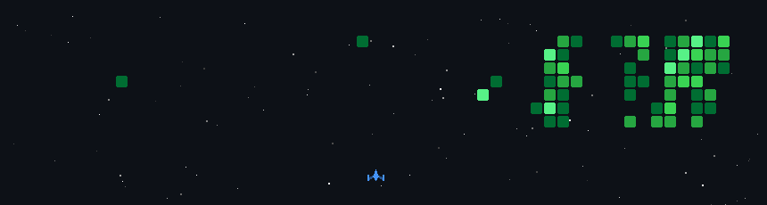

  

  <!-- Profile Views -->
  
 

  

## 💻 Tech Stack:

  !!      
 
 
 
 
 

<!-- 

  

 -->

## 📊 GitHub Stats:

  <table>
    <tr>
      <td>
        
      </td>
      <td>
        
      </td>
    </tr>
  </table>
  

  

  

<h2>🔄 LeetCode Progress</h2>

  

  

